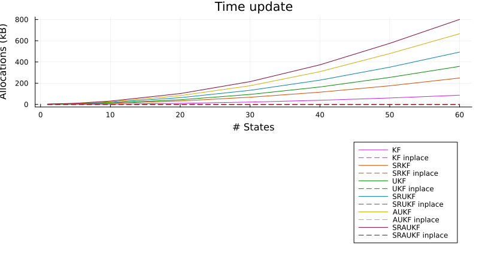
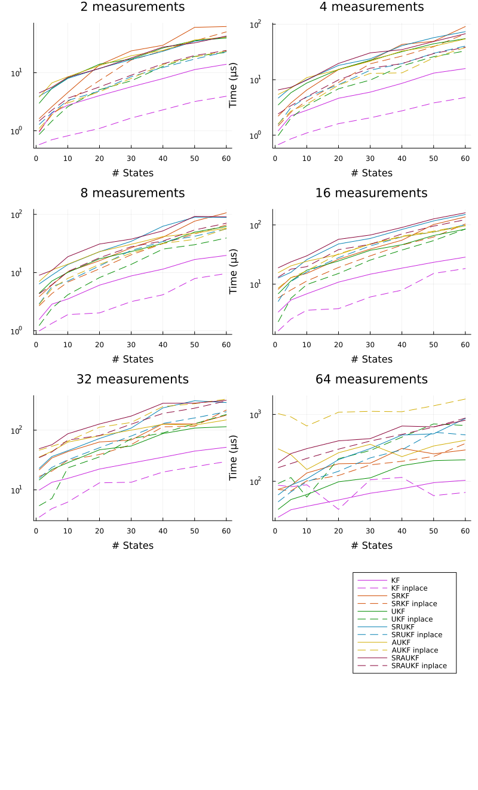

[](https://github.com/JuliaGNSS/KalmanFilter.jl/actions)
[](https://codecov.io/gh/JuliaGNSS/KalmanFilter.jl)
# KalmanFilter.jl
Provides multiple Kalman Filters

* (Square Root) Kalman Filter ((SR-)KF)
* (Square Root) Unscented Kalman Filter ((SR-)UKF)
* (Square Root) Augment Unscented Kalman Filter ((SR-)AUKF)

## Getting started

Install:
```julia
julia> ]
pkg> add KalmanFilter
```

## Usage

This package makes usage of multiple dispatch in Julia. 

If you'd like to use the (linear) Kalman-Filter, simply pass matrices for time update and measurement update function. If you'd like to use the Unscented-Kalman-Filter, pass functions to the time update and measurement update instead. You can also use the (linear) Kalman-Filter for the time update and the Unscented-Kalman-Filter for the measurement update or vice-versa.

If you pass cholesky decompositions for the state-covariance and the noise-covariante, this implementation will use the corresponding square-root variant.

If you like, you can augment the noise-covariance to the state-covariance, if you wrap the noise-covariance by `Augment`.

### Linear case
The linear Kalman Filter will be applied if you pass matrices `F` and `H` to the functions `time_update` and `measurement_update` respectively.
```julia
using KalmanFilter
Δt = 0.1
F = [1 Δt Δt^2/2; 0 1 Δt; 0 0 1]
H = [1, 0, 0]'
Q = [Δt^2/2; Δt; 1] * [Δt^2/2 Δt 1] * σ_acc_noise^2
R = σ_meas_noise^2
x_init = [0.0, 0.0, 0.0]
P_init = [2.5 0.25 0.1; 0.25 2.5 0.2; 0.1 0.2 2.5]
# Take first measurement
mu = measurement_update(x_init, P_init, measurement, H, R)
for i = 1:100
    # Take a measurement
    tu = time_update(get_state(mu), get_covariance(mu), F, Q)
    mu = measurement_update(get_state(tu), get_covariance(tu), measurement, H, R)
end
```
### Non-linear case
If you pass a function instead of matrix for `F` or `H`, the Unscented-Kalman-Filter will be used.
```julia
F(x) = x .* [1., 2.]
tu = time_update(x, P, F, Q)
```

### Augmentation
KalmanFilter also allows to augment the noise-covariances:
```julia
F(x, noise) = x .* [1., 2.] .+ noise
tu = time_update(x, P, F, Augment(Q))
H(x, noise) = x .* [1., 1.] .+ noise
mu = measurement_update(x, P, measurement, H, Augment(R))
```

### Square Root Kalman filter
If you'd like to use the square root variant of the Kalman filter, you will have to pass the cholesky decomposition of the corresponding covariance, for e.g.:
```julia
using LinearAlgebra
P_init_chol = cholesky(P_init)
Q_chol = cholesky(Q)
R_chol = cholesky(R)
tu = time_update(x_init, P_init_chol, F, Q_chol)
mu = measurement_update(get_state(tu), get_sqrt_covariance(tu), measurement, H, Augment(R_chol))
```

### Considered states

All variants support to *consider* some of the states in the measurement update. Considered states are states, that are considered in the model with its mean and variance, but are not updated in the update procedure. 

### Statistical consistency testing
This module provides two consistency tests
- the Normalized innovation squared (NIS) test
- the Innovation sigma bound test
  - tests if approximately 68% (95%) of the innovation sequence values lie within the ⨦σ (⨦2σ) bound

## Benchmarks

This module was build with performance in mind. For almost all variants of the Kalman-Filter you will find an inplace version. The inplace version is marked with an exclamation mark like e.g. `time_update!` and `measurement_update!`. The intermediate results are saved into an pre-allocated buffer. That's

Buffer | Variant
--- | ---
`KFTUIntermediate(num_states)` | (linear) Kalman-Filter time update
`KFMUIntermediate(num_states, num_measurements)` | (linear) Kalman-Filter measurement update
`SRKFTUIntermediate(num_states)` | (linear) Square-Root Kalman-Filter time update
`SRKFMUIntermediate(num_states, num_measurements)` | (linear) Square-Root Kalman-Filter measurement update
`UKFTUIntermediate(num_states)` | Unscented-Kalman-Filter time update
`UKFMUIntermediate(num_states, num_measurements)` | Unscented-Kalman-Filter measurement update
`SRUKFTUIntermediate(num_states)` | Square-Root Unscented-Kalman-Filter time update
`SRUKFMUIntermediate(num_states, num_measurements)` | Square-Root Unscented-Kalman-Filter measurement update
`AUKFTUIntermediate(num_states)` | Augmented Unscented-Kalman-Filter time update
`AUKFMUIntermediate(num_states, num_measurements)` | Augmented Unscented-Kalman-Filter measurement update
`SRAUKFTUIntermediate(num_states)` | Square-Root Augmented Unscented-Kalman-Filter time update
`SRAUKFMUIntermediate(num_states, num_measurements)` | Square-Root Augmented Unscented-Kalman-Filter measurement update

There is a benchmark to compare the different implementations in the benchmark folder. For the benchmark a linear model was chosen, that is supported by all variants.

### Time update



### Measurement update




In same cases the inplace variant is slower than the allocating variant. More investigation is needed to find out why this is the case.

## License

MIT License
