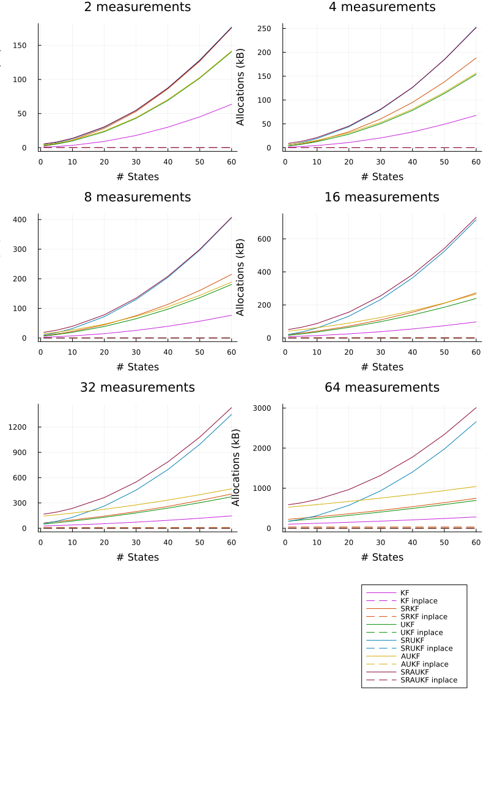

[](https://github.com/JuliaGNSS/KalmanFilters.jl/actions)
[](https://codecov.io/gh/JuliaGNSS/KalmanFilters.jl)
# KalmanFilters.jl
Provides multiple Kalman Filters

* (Square Root) Kalman Filter ((SR-)KF)
* (Square Root) Unscented Kalman Filter ((SR-)UKF)
* (Square Root) Augment Unscented Kalman Filter ((SR-)AUKF)

All filter implementation support the real and complexed valued inputs.

## Getting started

Install:
```julia
julia> ]
pkg> add KalmanFilters
```

## Usage

KalmanFilters.jl has very flexible structure. For example you are free to choose the type of the Kalman-Filter for the time update and measurement update independently. If you have a linear time update, you may choose the (linear) Kalman-Filter and if the measurement update is non-linear, you can choose the Unscented-Kalman-Filter for that or vice versa.
The distinction between the different Kalman-Filters is made by the input types:
If the model is defined by a matrix, the linear Kalman-Filter will be used. If the model is defined by a function or a [functor](https://docs.julialang.org/en/v1/manual/methods/#Function-like-objects) (in case you need to pass additional information), the implementation will assume, that the model is non-linear, and will, therefore, use the Unscented-Kalman-Filter.
If you’d like to augment the noise covariance, you will have to wrap the noise covariance by the `Augment` type.
It is also possible to use the Extended Kalman Filter by providing the predicted state and measurement vector alongside the Jacobians of the process and measurement model accordingly.

### Linear case
The linear Kalman Filter will be applied if you pass the process model `F` or the measurement model `H` as matrices to the functions `time_update` or `measurement_update` respectively.
```julia
using KalmanFilters
Δt = 0.1
σ_acc_noise = 0.02
σ_meas_noise = 1.0
# Process model
F = [1 Δt Δt^2/2; 0 1 Δt; 0 0 1]
# Process noise covariance
Q = [Δt^2/2; Δt; 1] * [Δt^2/2 Δt 1] * σ_acc_noise^2
# Measurement model
H = [1, 0, 0]'
# Measurement noise covariance
R = σ_meas_noise^2
# Initial state and covariances
x_init = [0.0, 0.0, 0.0]
P_init = [2.5 0.25 0.1; 0.25 2.5 0.2; 0.1 0.2 2.5]
# Take first measurement
measurement = 2.0 + randn()
mu = measurement_update(x_init, P_init, measurement, H, R)
for i = 1:100
    measurement = 2.0 + randn()
    tu = time_update(get_state(mu), get_covariance(mu), F, Q)
    mu = measurement_update(get_state(tu), get_covariance(tu), measurement, H, R)
end
```
### Non-linear case
If you define the process model `F` or the measurement model `H` as a function (or a [functor](https://docs.julialang.org/en/v1/manual/methods/#Function-like-objects)), the Unscented-Kalman-Filter will be used.
```julia
F(x) = x .* [1., 2.]
tu = time_update(x, P, F, Q)
```
If you want to use the Extended Kalman Filter instead, you have to determine the Jacobian of the process model `Jf` at the current state estimate `x`, predict the state vector using the non-linear process model, and provide both for the time update.
```julia
x_apri = F(x);
tu = time_update(x, x_apri, P, Jf, Q)
```
The same applies for the measurement update with the Jacobian of the measurement model `Jh` at the current state estimate `x`.
```julia
y_pre = H(x);
mu = measurement_update(get_state(tu), get_covariance(tu), measurement, y_pre, Jh, R)
```

### Augmentation
KalmanFilters also allows to augment the noise-covariances:
```julia
F(x) = x .* [1., 2.]
F(x, noise) = x .* [1., 2.] .+ noise
tu = time_update(x, P, F, Augment(Q))
H(x) = x .* [1., 1.]
H(x, noise) = x .* [1., 1.] .+ noise
mu = measurement_update(x, P, measurement, H, Augment(R))
```

### Square Root Kalman filter
If you'd like to use the square root variant of the Kalman filter, you will have to pass the cholesky decomposition of the corresponding covariance, for e.g.:
```julia
using LinearAlgebra
P_init_chol = cholesky(P_init)
Q_chol = cholesky(Q)
R_chol = cholesky(R)
tu = time_update(x_init, P_init_chol, F, Q_chol)
mu = measurement_update(get_state(tu), get_sqrt_covariance(tu), measurement, H, R_chol)
```

### Considered states

All variants support to *consider* some of the states in the measurement update. Considered states are states, that are considered in the model with its mean and variance, but are not updated in the update procedure. To use this feature, there is an optional paramter `consider`:
```julia
measurement_update(x, P, measurement, H, R, consider = 3:5)
```

### Statistical consistency testing
This module provides two consistency tests
- the Normalized innovation squared (NIS) test
- the Innovation sigma bound test
  - tests if approximately 68% (95%) of the innovation sequence values lie within the ⨦σ (⨦2σ) bound

## Benchmarks

This module was build with performance in mind. For almost all variants of the Kalman-Filter you will find an inplace version. The inplace version is marked with an exclamation mark like e.g. `time_update!` and `measurement_update!`. The intermediate results are saved into an pre-allocated buffer. That's

Buffer | Variant
--- | ---
`KFTUIntermediate(num_states)` | (linear) Kalman-Filter time update
`KFMUIntermediate(num_states, num_measurements)` | (linear) Kalman-Filter measurement update
`SRKFTUIntermediate(num_states)` | (linear) Square-Root Kalman-Filter time update
`SRKFMUIntermediate(num_states, num_measurements)` | (linear) Square-Root Kalman-Filter measurement update
`UKFTUIntermediate(num_states)` | Unscented-Kalman-Filter time update
`UKFMUIntermediate(num_states, num_measurements)` | Unscented-Kalman-Filter measurement update
`SRUKFTUIntermediate(num_states)` | Square-Root Unscented-Kalman-Filter time update
`SRUKFMUIntermediate(num_states, num_measurements)` | Square-Root Unscented-Kalman-Filter measurement update
`AUKFTUIntermediate(num_states)` | Augmented Unscented-Kalman-Filter time update
`AUKFMUIntermediate(num_states, num_measurements)` | Augmented Unscented-Kalman-Filter measurement update
`SRAUKFTUIntermediate(num_states)` | Square-Root Augmented Unscented-Kalman-Filter time update
`SRAUKFMUIntermediate(num_states, num_measurements)` | Square-Root Augmented Unscented-Kalman-Filter measurement update

There is a benchmark to compare the different implementations in the benchmark folder. For the benchmark a linear model was chosen, that is supported by all variants.

### Time update


### Measurement update




In same cases the inplace variant is slower than the allocating variant. More investigation is needed to find out why this is the case.

## License

MIT License
